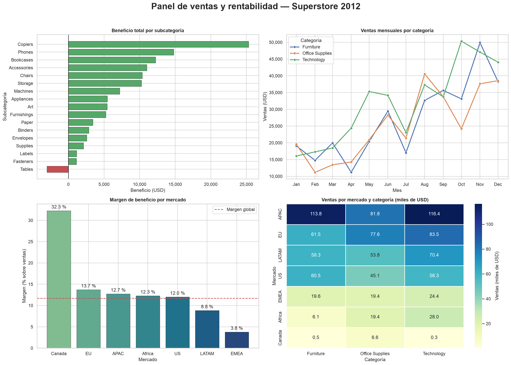

# Trabajo 4 — Visualización de datos con Matplotlib y Seaborn

Análisis visual de las ventas de una cadena minorista global (**Superstore, 2012**) con Pandas, Matplotlib y Seaborn: preparación de los datos, gráficos univariantes, bivariantes y multivariantes, un panel con subplots y conclusiones para el negocio.



## Archivos del proyecto

| Archivo | Descripción |
|---|---|
| `visualizacion_superstore.ipynb` | Notebook principal con todo el análisis, ya ejecutado (se ven los gráficos sin volver a correrlo) |
| `superstore_dataset2012.csv` | Dataset: 4.246 líneas de pedido de 2012 con 24 columnas |
| `imagenes/` | Las 11 figuras generadas, guardadas en PNG |
| `requirements.txt` | Bibliotecas necesarias |

## Preparación de los datos (Pandas)

- Exploración: tamaño, tipos (`info()`), nulos, duplicados y estadísticas (`describe()`).
- **Conversión de fechas:** `Order Date` y `Ship Date` venían como texto y en dos formatos mezclados (`1/2/2012` y `13-01-2012`). Se comprobó con los datos que ambos son día/mes/año y se convirtieron con `pd.to_datetime(..., format='%d/%m/%Y')` tras unificar el separador. Validación: el envío tarda siempre entre 0 y 7 días.
- Se eliminó `Postal Code` (80,6 % de nulos).
- Columnas nuevas: `Dias Envio`, `Mes`, `Margen %` y `Rango Descuento` (con `pd.cut`).
- Variables categóricas convertidas a `category`, con orden lógico en `Ship Mode`.

## Visualizaciones

| # | Tipo | Biblioteca | Gráfico |
|---|---|---|---|
| 1 | Univariante | Matplotlib | Histograma de ventas (escala logarítmica, con media y mediana) |
| 2 | Univariante | Matplotlib | Barras de líneas de pedido por segmento |
| 3 | Univariante | Seaborn | Boxplot del beneficio por categoría |
| 4 | Univariante | Seaborn | Violinplot de días de envío por modo de envío |
| 5 | Bivariante | Matplotlib | Líneas: evolución mensual de ventas y beneficio (doble eje) |
| 6 | Multivariante | Matplotlib | Dispersión ventas vs beneficio, con color = descuento y tamaño = cantidad |
| 7 | Bivariante | Seaborn | Barras agrupadas: ventas por mercado y categoría |
| 8 | Bivariante | Seaborn | `regplot`: descuento vs beneficio medio |
| 9 | Multivariante | Seaborn | Heatmap de correlación |
| 10 | Multivariante | Seaborn | Pairplot por categoría |
| 11 | Panel | Matplotlib + Seaborn | Figura 2x2 con título general: beneficio por subcategoría, ventas mensuales por categoría, margen por mercado y heatmap mercado × categoría |

Todas las figuras tienen título, etiquetas de ejes, leyendas cuando hacen falta y paletas elegidas para cada caso (colores fijos por categoría en todo el notebook).

## Principales conclusiones

1. **La venta típica es pequeña:** mediana de 83 USD por línea frente a una media de 237 USD.
2. **Consumer** es el segmento principal (53,8 %) y **APAC**, **EU** y **LATAM** son los mercados con más ventas.
3. **Technology** es la categoría más rentable (margen del 15,3 %), frente a Office Supplies (11,3 %) y Furniture (7,7 %).
4. **El descuento destruye beneficio:** por encima del 20 %, el beneficio medio por línea es negativo, y el 25,4 % de las líneas genera pérdidas.
5. **Tables** es la única subcategoría con pérdidas y **EMEA** el mercado con peor margen (3,8 %).
6. La logística cumple el plazo de cada modo de envío, y las ventas crecen hacia final de año.

**Recomendación:** limitar los descuentos superiores al 20 %, sobre todo en Furniture y en EMEA, y reforzar Technology.

## Cómo ejecutarlo

```bash
pip install -r requirements.txt
jupyter notebook visualizacion_superstore.ipynb
```

El CSV debe estar en la misma carpeta que el notebook. Las imágenes se regeneran en `imagenes/` al ejecutarlo.

## Tecnologías utilizadas

- Python 3
- Pandas — carga, limpieza y transformación de datos
- NumPy — cálculos auxiliares
- Matplotlib — gráficos y panel de subplots
- Seaborn — gráficos estadísticos
- Jupyter Notebook
